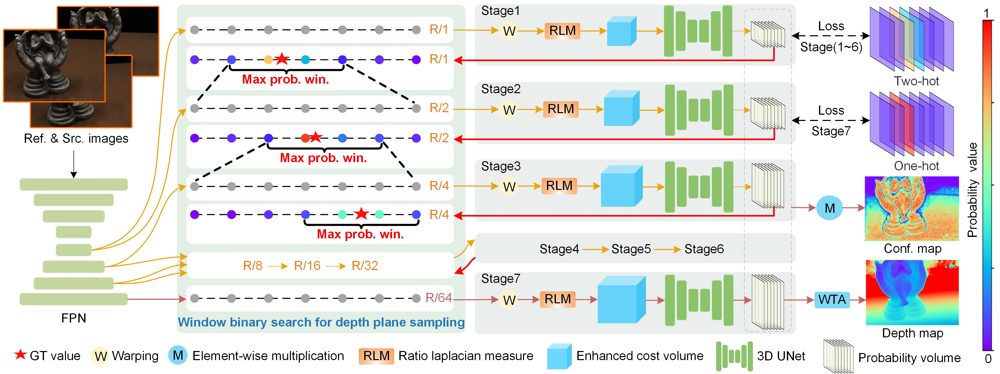

## _ECVR-MVS: Enhancing Cost Volume Representation with Window Binary Search and Ratio Laplacian Measure for Multi-View Stereo_



* We design the Window Binary Search (WBS) method, which chooses binary windows with the highest probability along the sampled depth planes as the sampling regions for the next stage. Ensuring the cost volume is built on more beneficial depth planes to improve availability.
* We encode ground truth (GT) with the proposed Two-hot method to supervise the probability volumes associated with WBS. This approach ensures that depth planes closer to the actual depth have higher probabilities, aligning better with actual matching patterns.
* We introduce the Ratio Laplacian Measure for feature volume aggregation, achieving a view-weighted point similarity measure to improve the matching results of the multi-view features.

### Data Preparation
Our work mainly uses [DTU](https://roboimagedata.compute.dtu.dk/), [BlendedMVS](https://github.com/YoYo000/BlendedMVS/), and [Tanks and Temples](https://www.tanksandtemples.org/) datasets to train and evaluate our models. 

* DTU training set(640x512): [Aliyun Netdisk](https://www.alipan.com/t/xiI4abmEPr1dGNbXyAVF)
* DTU test set(1600x1200): [Baidu Netdisk](https://pan.baidu.com/s/15hZZ3eY2bSZnae5M079gIQ) code：6au3
* BlendedMVS dataset(768x576): [Official Website](https://cp4fqw.ch.files.1drv.com/y4m08CBjNdPb3ORDVxBM6I7mMisIdlVDNpKuwlW9gt5VwQdjk9irqewHxPO0U6G_CPv3RWbxNUOXo7a_GmC_ivQD6GyAw2A-pu87g9ZSF7TXUQzPOvEXEJFNHCYhfKT_-5cphQy3WcH5d1v_9SAOTK-830V7JczTRv37CeoxBTmRl_8tOD84I_B5MXE0Xw5n9G7bUdiXtXya7cQa8b4ChqJQQ)
* Tanks and Temples dataset: [Baidu Netdisk](https://pan.baidu.com/s/1bP_18iHgu9ITyiR-sj8SkQ) code：taj1
* Eth3d dataset

### Training

1. Check the configuration:
   
   args/base.py
   * `root_dir`: root directory of all datasets.

   args/dtu.py
   * `DTUTrain.dataset_path`: DTU Training set directory.
   * `DTUTrain.pair_path`: DTU "pair.txt" file path.
   * `DTUVal.dataset_path`: DTU validation set directory.
   * `DTUVal.pair_path`: DTU "pair.txt" file path.
   
   args/bld.py
   * `BlendedMVSTrain.dataset_path`: BlendedMVS Training set directory.
   * `BlendedMVSVal.dataset_path`: BlendedMVS validation set directory.

2. Run the script for training.
```
# for DTU
python train.py -d dtu 
# for BlendedMVS
python train.py -d bld
# fine-tuned on the BlendedMVS 
python train.py -d bld -p pth/dtu_11_136100.pth
```

### Testing

1. Check the configuration:
   
   args/base.py
   * `root_dir`: root directory of all datasets
   * `output_path`: output directory
   
   args/dtu.py
   * `DTUTest.dataset_path`: DTU test set directory
   * `DTUTest.pair_path`: DTU "pair.txt" file path
   
   args/tanks.py
   * `TanksTest.dataset_path`: Tanks and Temples dataset directory
   * `TanksTest.scence_list`: Tanks and Temples dataset all scenes list
   
   args/eth3d.py
   * `Eth3dTest.dataset_path`: Eth3d dataset directory
   * `Eth3dTest.scence_list`: Eth3d dataset all scenes list

   args/custom.py
   * `CustomTest.dataset_path`: custom dataset directory
   * `CustomTest.scene_list`: custom dataset all scenes list

2. Run the script for the test.
```
# DTU
python test.py -p pth/dtu_11_136100.pth -d dtu
# Tanks and Temples
python test.py -p pth/bld_9_74100.pth -d tanks
# Eth3d
python test.py -p pth/bld_9_74100.pth -d eth3d
# Custom dataset
python test.py -p pth/bld_9_74100.pth -d custom
```


### Fusion
1. Check the configuration.
   
   tools/filter/conf.py
   * `dataset`: select dataset, such as dtu, tanks-inter, tanks-adv, custom
   * `dataset_root`: current dataset root directory
   * `test_folder`: the root path where `test.py` outputs depth maps, confidence maps, etc. 
   * `outply_folder`: output point cloud save path
   * `scenes`: scenes included in the current dataset
   
2. Run.
```
cd tools/filter
python dypcd.py
```


### Results

#### DTU dataset (Single NVIDIA GeForce RTX 3090)
| Acc(mm) |  Comp(mm)  | Overall(mm) | Time(s/view) | Memory(GB) |
|:-------:|:----------:|:-----------:|:------------:|:----------:|
|  0.339  |    0.245   |    0.292    |    0.255     |    2.97    |

#### Tanks and Temples - Intermediate
| Fam.  | Fra.  | Hor.  | Lig.  | M60   | Pan.  | Pla.  | Tra.  | Mean↑ | 
|:-----:|-------|-------|-------|-------|-------|-------|-------|-------|
| 82.28 | 69.48 | 62.92 | 64.48 | 66.06 | 62.13 | 62.58 | 60.07 | 66.25 |  

#### Tanks and Temples - Advanced
| Aud.  | Bal.  | Cou.  | Mus.  | Pal.  | Tem.  | Mean↑ | 
|:-----:|-------|-------|-------|-------|-------|-------|
| 33.17 | 46.23 | 41.11 | 53.40 | 36.39 | 39.71 | 41.67 |  
     

### Acknowledgements
Our work is partially based on these opening source work: [MVSNet](https://github.com/YoYo000/MVSNet), [MVSNet-pytorch](https://github.com/xy-guo/MVSNet_pytorch), [CasMVSNet](https://github.com/alibaba/cascade-stereo/tree/master/CasMVSNet), [D2HC-RMVSNet](https://github.com/yhw-yhw/D2HC-RMVSNet).
We appreciate their contributions to the MVS community.


### Citation
If you find this project useful for your research, please cite:  

```bibtex
@article{

}
```
